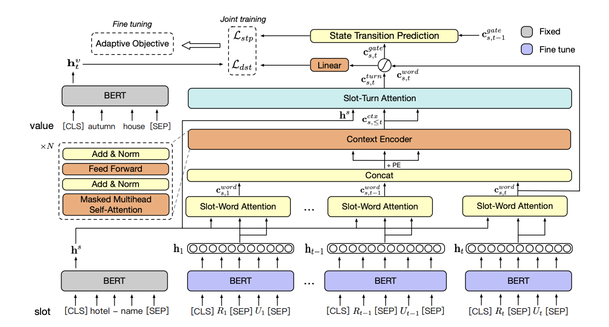
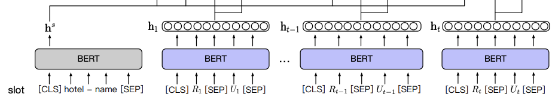
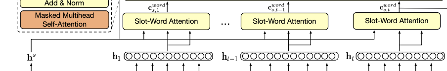
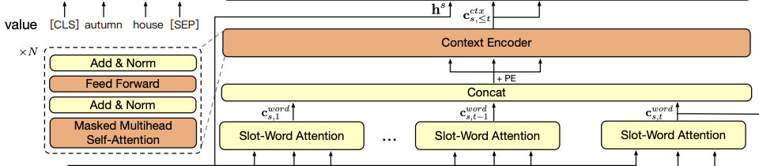
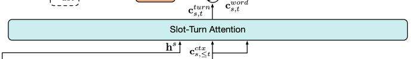
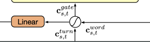
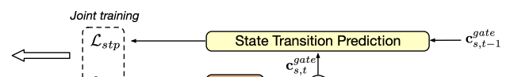

## CHAN-DST

- slot imbalance 문제를 해결하고자 adaptive objective를 도입
- a contextual hierarchical attention network (CHAN)를 사용: dislogue history에서 relevant context를 찾기 위함
  → 각 턴의 발화로부터 word-level 관련 정보 검색
  → contextual representation으로 encode
  → 모든 context표현을 turn-level관련 정보로 집계한 후 word-level 정보와 합친 output 생성
- state transition prediction task

---

## Definition

- $$T$$: turn
- $$U_t$$: user utterance of turn t
- $$R_t$$: system response of turn t
- $$X$$: $$\left\{(U_1, R_1), ... , (U_T, R_T)\right\}$$
- $$B_t$$: $$\left\{(s, v_t), s \in S\right\}$$
- $$S$$: set of slots
- $$v_t$$: corresponding value of the slot $$s$$
- slot: concatenation of a domain name and a slot name

---

## Contextual Hierarchical Attention Network

### 1. Sentence Encoder

`utterance encoder`

- BERT special token사용
  → [CLS] : 문장의 representation들을 합치기위해 사용 (to aggregate the whole representation of a sentence)
  → [SEP] : 문장의 끝을 나타내기위해 사용.
- $$U_t = \left\{w_1^u, ..., w_l^u\right\}$$ (user utterance)
  $$R_t = \left\{w_1^r, ..., w_{l'}^r\right\}$$ (system response)
  $$t$$: dialogue turn
- $$h_t = BERT_{finetune}([R_t;U_t])$$
  ($$h_t$$: contextual word representations)
- 여기서 BERT finetune은 training도중 finetuning이 될것을 의미.

`slot-value encoder`

- $$BERT_{fixed}$$는 contextual semantics vectors로 encode해준다.
- utterance encode할때와 다른 점은 [CLS] 토큰의 output vector를 전체 문장 representation할때 사용한다. (to obtain the whole sentence representation)
- $$h_s = BERT_{fixed}(s)$$
  $$h_t^v = BERT_{fixed}(v_t)$$
- $$BERT_{fixed}$$는 training 도중 고정되어있다. 그래서 우리 모델은 unseen slots and values에 대해서 original BERT representation로 확장해서 보는게 가능하다.

### 2. Slot-Word Attention

- slot-word attention은 multi-head attention을 사용한다.
- $$c_{s,t}^{word} = MultiHead(h^s, h_t, h_t)$$

### 3. Context Encoder

- context encoder : unidirectional transformer encoder
- {1, ..., t} 턴에서 추출 된 word-level slot-related 정보의 contextual relevance를 모델링하기 위한 것.
- $$N$$개의 idenctical한 layer가 있다.
    - 각 layer는 2개의 sub-layer를 가지고 있다.
    - 첫번째 sub-layer: masked multi-head self-attention(Q = K = V)
    - 두번째 sub-layer: position-wise fully connected feed-forward network(FFN) (two linear transformations, RELU activation으로 구성)
    - $$FFN(x) = max(0, xW_1 + b_1)W_2 + b_2$$
- $$m^n = FFN(MultiHead(m^{n-1}, m^{n-1}, m^{n-1}))$$
  $$m^0 = [c_{s,1}^{word} + PE(1), ..., c_{s,t}^{word} + PE(t)]$$
  $$c_{s,\leq t}^{ctx} = m^N$$
- $$m^n$$: n번째 context encoder레이어의 아웃풋
  $$PE(.)$$: positional encoding function

### 4. Slot-Turn Attention

- turn-level relevant information을 contextual representation에서 검출해내기 위해 사용
- $$c_{s,t}^{turn} = MultiHead(h^s, c_{s,\leq t}^{ctx},c_{s,\leq t}^{ctx})$$
- 이로인해 word-level and turn-level 의 relevant information을 historical dialogues에서 얻어낼 수 있다.

### 5. Global-Local Fusion Gate

- global context와 local utterance의 균형을 맞추기 위해, contextual information과 current turn information의 비율을 조절함.
- $$c_{s,t}^{word},~~ c_{s,t}^{turn}$$에 따라 global과 local정보가 어떻게 결합되어야할지 알려주는 fusion gate mechanism을 사용
- $$g_{s,t} = \sigma(W_g\bigodot[c_{s,t}^{word};c_{s,t}^{turn}])$$
- $$c_{s,t}^gate = g_{s,t}\bigotimes c_{s,t}^{word} + (1-g_{s,t}\bigotimes c_{s,t}^{turn})$$
    - $$W_g \in R^{2d\times d}$$
    - $$\sigma$$: Sigmoid
    - $$\bigodot$$, $$\bigotimes$$
- $$o_{s,t}$$ = LayerNorm(Linear(Dropout($c_{s,t}^{gate}$)))
- **value $$v_t$$에 대한 확률분포와 training objective**
  $$p(v_t|U_{\leq t},~R_{\leq t}, s) = exp(-||o_{s,t} - h_t^v||2)\over {\sum{v'\in V_s}exp(-||o_{s,t}-h_t^{v'}||2)}$$
  *$$L{dst}$$* $$= \sum_{s\in S}\sum ^T_{t = 1}-log(p(\hat v_t|U_{\leq t},~R_{\leq t}, s))$$
    - $$V_s$$: candidate value set of slot s
    - $$\hat v_t \in V_s$$: ground-truth value of slot s

---

## State Transition Prediction

- relevant context를 더 잘 포착하기 위해, auxiliary binary classification task사용.
- $$c_{s,t}^{stp} = tanh(W_c \odot c_{s,t}^{gate})$$
- $$p_{s,t}^{stp} = \sigma (W_p \odot [c_{s,t}^{stp};c_{s, t-1}^{stp}])$$
    - $$W_c \in \R^{d\times d}$$
    - $$W_c \in \R^{2d}$$
    - $$t = 1$$일때는 $$c_{s,t}^{stp}$$와 zero vectors를 concat함.
- binary CE loss ($$y_{s,t}^{stp}$$: ground-truth transition labels // $$p_{s,t}^{stp}$$: transition probability)
- $$L_{stp} = \sum_{s\in S}\sum_{t = 1}^T -y_{s,t}^{stp}~.~log(p_{s,t}^{stp})$$

---

## Adaptive Objective

- hard slots와 samples에 관한 optimization을 encourage한다.
- all slots의 learning을 balancing함.
- $$acc_s^{val}$$: accuracy of slot s on validation set
- `slot-level difficulty`
if $$acc_s^{val} \leq acc_{s'}^{val}$$;
  → slot s 가 slot s'보다 더 어려운 것.
  → $$\alpha$$: slot-level difficulty
    - $$\alpha_s = {1 - acc_s^{val} \over {\sum_{s'\in S} 1-acc_{s'}^{val}}} \cdot |S|$$
- `sample-level difficulty`
  → Suppose there are two samples $$\left\{(U_t, R_t),(s, v_t)\right\}$$ and $$\left\{(U_{t'}, R_{t'}),(s', v_{t'})\right\}$$
  → 만약 former confidence 가 latter보다 더 낮다면, 첫번째 sample이 두번째보다 더 어려운 것.
  → $$\beta$$: sample level difficulty
    - $$\beta(s, v_t) = (1 - p(s, v_t))^\gamma$$
    - $$p(s,v_t)$$: confidence of sample $$(U_t, R_t),(s, v_t)$$
    $$\gamma$$: hyper-parameter
- $$L_{adapt}(s,v_t) = -\alpha_s\beta(s, v_t)log(p(s, v_t))$$
- slot s가 평균 slot의 difficulty보다 높다면, $$\alpha_s$$는 s에 대한 loss를 키울 것이다. 비슷하게, sample의 optimization이 low confidence를 갖고 있다면 loss는 커질것이다.

---

### Optimization

- During joint training, we optimize the sum of these two loss functions as following
  $$L_{joint} = L_{dst} + L_{stp}$$
- At the fine-tuning phase, we adopt the adaptive objective to fine-tune DST task as following
  $$L_{finetune} = \sum_{s\in S}\sum^T_{t=1}L_{adapt(s, \hat v_t)}$$

---

## 참고 자료

- 논문: [A Contextual Hierarchical Attention Network with Adaptive Objective for Dialogue State Tracking](https://www.aclweb.org/anthology/2020.acl-main.563.pdf)
- GitHub: [CHAN-DST](https://github.com/smartyfh/CHAN-DST)
