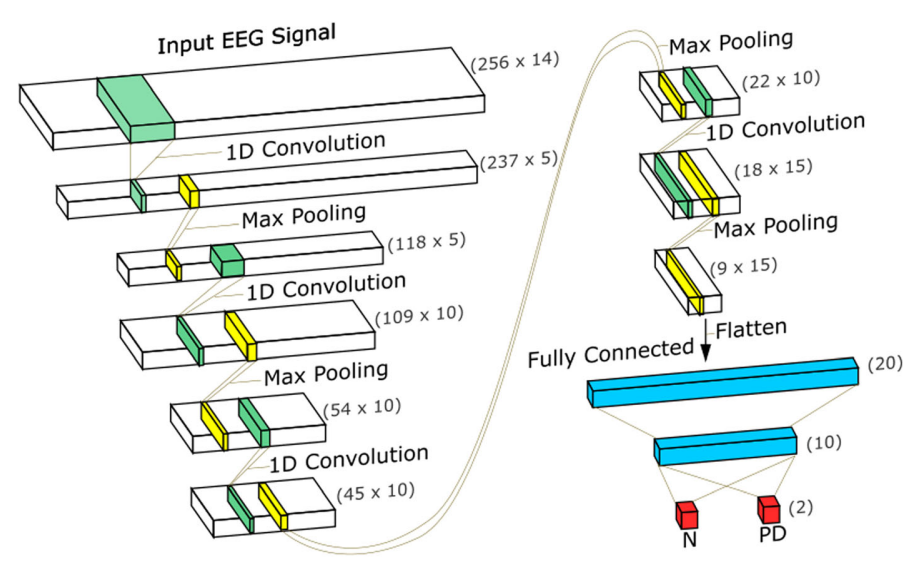
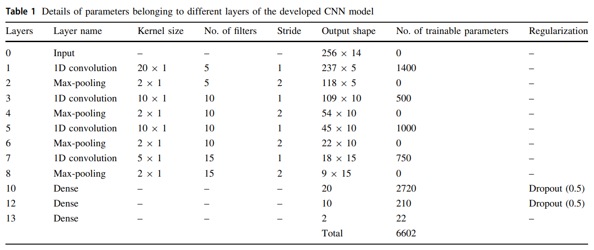
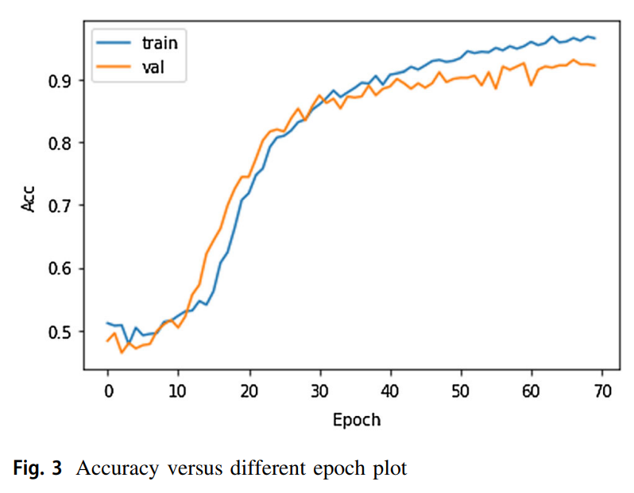
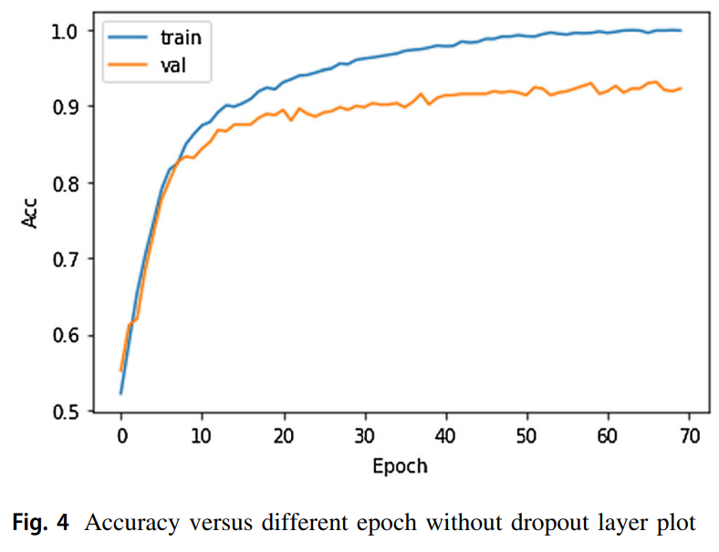
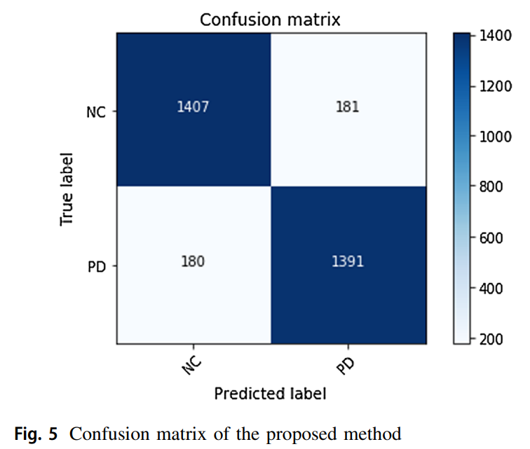
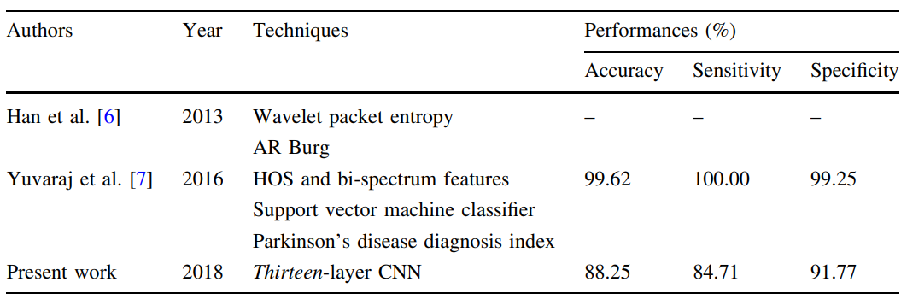
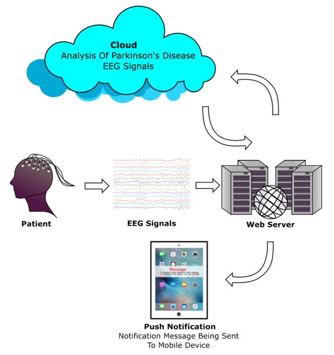

## `Neural Computing and Applications (2018)`

### Proposed CNN architecture

- stratified tenfold cross-validation
- Adam optimization with a learning rate of 0.0001
- activation functions such as Relu for all layers
- softmax for the last layer
- dropout is set to 0.5

the kernel size and number of filters are obtained through the **brute force technique**

### Subjects

20 PD patients (10 women and 10 men)

- age range between 45 and 65 years old
- average period of PD of 5.75 ± 3.52 years
    - ranging from 1 to 12 years
        - Stage (i) - 2
        - Stage (ii) - 11
        - Stage (iii) - 7
- MNSE(mini-mental status examination) results: observed to be **inside the range of the normal limits** [26.90 ± 1.51 (range 25-30)]

20 normal subjects in the same age group (9 men and 11 women)

- age of 58.10 ± 2.95
- with no past record or indications of neurological or mental disorder were enlisted
- MNSE results: 27.15 ± 1.63 years

### EEG recordings and pre-processing

lasted 5 min in resting state (to attain a state of relaxed wakefulness) at **128 Hz sampling rate**

emotive EPOC neuroheadset of **14 channels**

the signals were **segmented into 2-s window length**

A **threshold technique** was used to discard the signal amplitudes exceeding ± 100 $\mu$V **to remove the eye blinking artifacts**

**6th-order bandpass Butterworth filter with forward reverse filtering technique** was employed to filter the frequency range of 1-49 Hz

### Results

- Accuracy: 88.25%
- Sensitivity: 84.71%
- Specificity: 91.77%

**performance of the model**

- with dropout layer

- without dropout layer

→ without the dropout layer, there is a possibility of overfitting of data

### Discussion

- 기존 연구와의 비교

- 향후목표

- 장단점
    - advantages
        1. A thirteen-layer CNN model is designed to automatically identify PD using EEG signals.
        2. Extraction, selection, and classification of features are not required in the proposed CNN model.
        3. The model is validated with a stratified tenfold crossvalidation technique.
        4. This is the first work to implement the deep learning technique for the detection of PD using EEG signals.
        5. It obtains good performance even with less number of normal and PD subjects. Hence, the developed is robust.
    - disadvantages
        1. It uses limited number of (20 normal and 20 PD) subjects to develop the CNN model.
        2. The CNN structure is computationally expensive as compared to the conventional machine learning techniques.

---

## 참고 자료

- 논문: [A deep learning approach for Parkinson’s disease diagnosis from EEG signals](https://link.springer.com/article/10.1007/s00521-018-3689-5)
