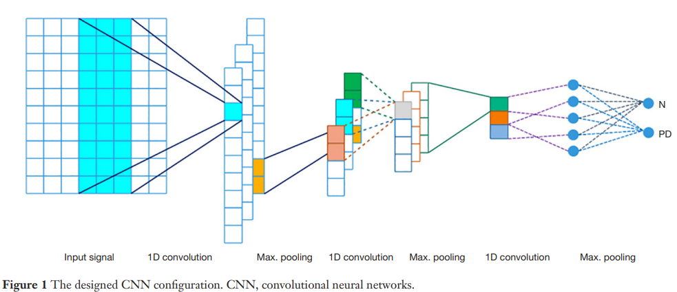
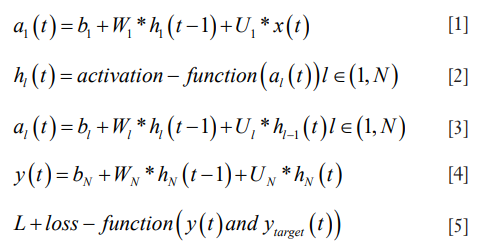
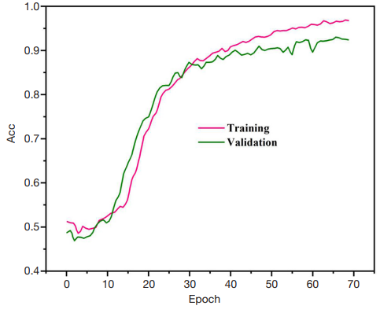
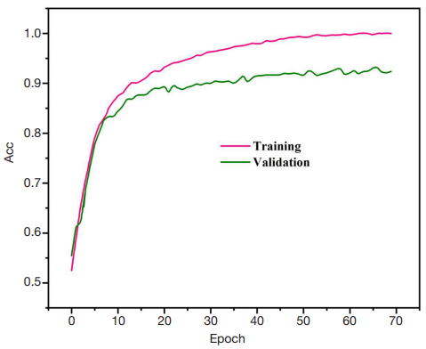
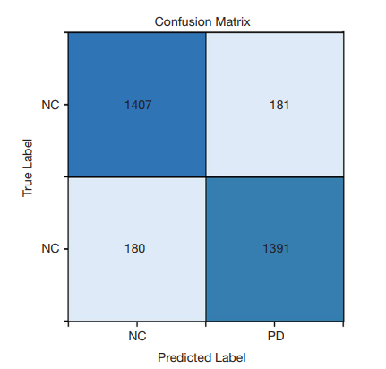
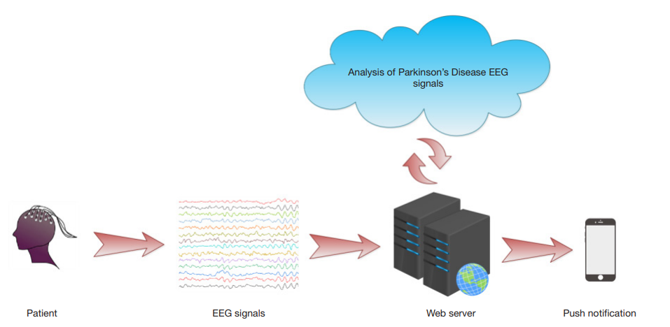

## `Annals of Translational Medicine (2020)`

### pooling-based deep recurrent neural network (PDRNN)

### DRNN architecture

The RNN maps the input vector $$(x)$$ to the equivalent output set $$(y)$$. In this graph, the learning procedure is carried out in each time-step in the range of $$t=1\:\:to\:\:τ$$. The sharing states related to the variables of each node in the $$l^{th}$$ layer are updated as follows

- $$x(t)$$: input in time-step $$t$$
- $$y(t), y_{target}(t)$$: predicted and real output
- $$h_l(t)$$: sharing states of layer $$l$$
- $$a_l(t)$$: input of $$l^{th}$$ layer that is composed of
    1. $$x(t)$$ or $$h_{l-1}(t)$$
    2. $$b$$ (bias values)
    3. $$h_{l}(t-1)$$

⇒ Because of the shared features of the recurrent neural network, it is able to learn the iterated uncertainties of the prior time-steps

vanilla RNN 대신 LSTM을 사용함으로써 overcome this problem by generating paths through which the gradient is able to flow in long periods

- stratified 10-fold cross validation
- Single Sign On (SSO) optimizer
- 1E-4 training rate
- activation functions such as Relu in all layers
- softmax in the last layer
- dropout is adjusted to 0.5 in the dropout layer

### Parkinson's and healthy cases

20 PD patients (10 males and 10 females)

- age range between 45 and 65 years old
- average period of PD of 5.75 ± 3.52 years
    - ranging from 2 to 10 years
        - Phase 1: two patients
        - Phase 2: eleven patients
        - Phase 3: seven patients
- The obtained Mini-Mental State Examination (MMSE) results were **within the range of the typical boundaries** of 25 to 30 (26.9 ± 1.51)

20 healthy cases with equal age range (9 males and 11 females) without past a record of neurological (or mental) disorders were also examined

- The MMSE results obtained from the healthy cases were in the range of 27.15 ± 1.63 years.

### Preprocessing phase and EEG signals

5 minutes in the steady state with a 128-Hz sample rate

emotive EPOC neuroheadset with 14 channels

the recorded signals were divided into 2-second window lengths

threshold method for eliminating the signals at a level higher than ±100 μV (in order to eliminate
the eye-blinking effects)

frequencies were filtered using a Butterworth six-order band-pass filter with the forward-reverse method

### PDRNN analysis

- Accuracy: 88.57%
- Precision: 88.31%
- Sensitivity: 84.84%
- Specificity: 91.81%

**performance of the model**

- with dropout layer

- without dropout layer

→ Remarkably, it was possible for over-fitting to occur in the model without a dropout layer.

### Discussion

- 기존 연구와의 비교
- 향후목표

- The main novelties of the proposed method are summarized as follows
    1. A deep RNN architecture equipped with LSTM units can automatically detect PD using EEG
    signals
    2. The extraction, selection, and classification of the features is not required
    3. A stratified 10-fold cross validation method is used for authentication of the model
    4. This is the first time a deep learning method has been proposed to diagnose PD using EEG signals
    5. Good diagnostic efficiency could be achieved even with a low number of healthy and PD cases, which shows good robustness of the proposed model
- Nevertheless, our proposed method and study may also exhibit the following limitations
    1. A low number of cases (20 healthy and 20 PD cases) were used for developing the proposed PDRNN model
    2. The proposed PDRNN model may have high computing costs in comparison with the traditional machine learning methods

---

## 참고 자료

- 논문: [Using a deep recurrent neural network with EEG signal to detect Parkinson’s disease](https://www.ncbi.nlm.nih.gov/pmc/articles/PMC7396761/)
