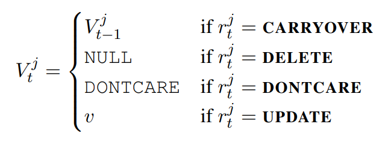
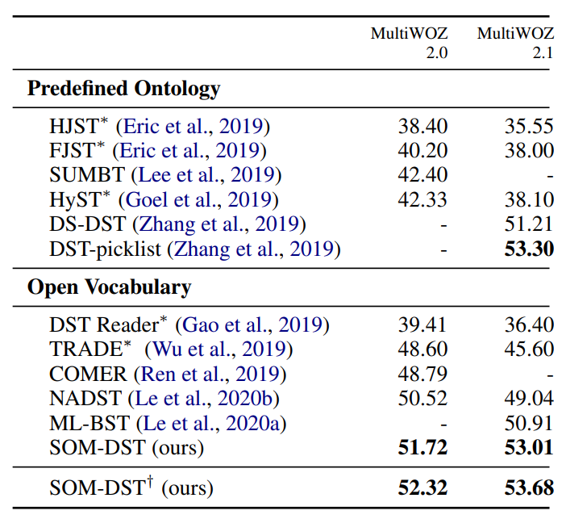
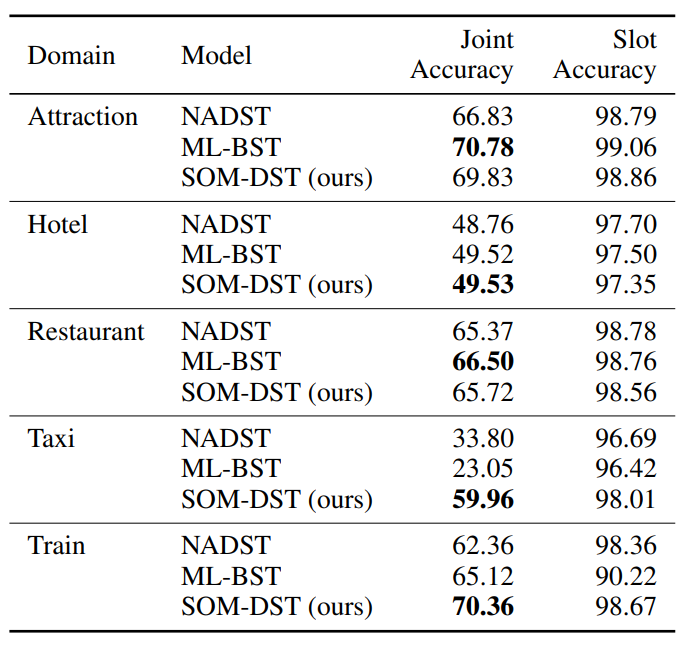
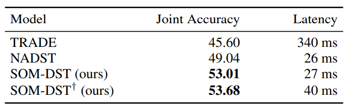

## SOM-DST


## 기존 모델의 문제점

### Ontology-based DST

- 실제 시나리오에 잘 대응하지 못함
- unseen value를 처리할 수 없음
- ontology가 많으면 처리 시간이 오래 걸림

### Open-vocab-based DST (TRADE)

- turn마다 slot의 모든 value를 생성해야해서 비효율적임

---

## Definition

$$t$$: turn

$$S^j$$: slot

$$V^j_t$$: corresponding slot value

$$J$$: total number of such slots

$$r^j_t\in O = \left\{\rm\textbf{CARRYOVER, DELETE, DONTCARE, UPDATE}\right\}$$

$$A_t$$: System response

$$U_t$$: User utterance

---

## State Operation Predictor (Encoder)

Encoder 모델로 **pretrained BERT encoder** 사용

### <span style="background-color:#fcffb0">Encoder Input을 만들기 위한 준비물</span>

$$D_t = A_t ⊕ ; ⊕ U_t ⊕ [SEP]$$: dialogue utterances at turn t

- `;` $A_t$와 $U_t$를 구분하기 위한 스페셜 토큰
- `[SEP]` dialogue turn이 끝났다는 것을 표시하기 위한 스페셜 토큰

$$B_t^j = [SLOT]^j ⊕ S^j ⊕ - ⊕ V_t^j$$ : representation of the j-th slot-value pair

- j-th slot-value pair를 하나의 벡터로 aggregate
- $$`[SLOT]^j`$$

    [SLOT] 이라는 스페셜 토큰을 사용

    BERT의 [CLS] 토큰과 같은 역할

- $$`V_t^j`$$

    

$$B_t = B_t^1 ⊕ ... ⊕ B_t^J$$ : representation of the dialogue state at turn t

### Encoder Input
```
$$X_t = [CLS] ⊕ D_{t-1} ⊕D_t ⊕ B_{t-1}$$

segment id:        0       1         1
```
⇒ **Input : Sum($X_t$ embedding, segment id embedding, positional embedding)**

dialogue history로 이전 턴의 dialogue utterances $$D_{t-1}$$을 사용한다.
dialogue history의 size: 1

모델이 입력으로 들어오는 dialogue 간의 `Markov property`를 가정

이전 turn dialogue state $$B_{t-1}$$은 전체 dialogue history를 압축적으로 표현하는 역할

### Encoder Output

$$H_t \in \mathbb R^{\left|X_t\right|\times d}$$ : $$h_t^{\rm X}$$ $$(t=1...t)$$ 까지 집합

$$h_t^{[CLS]}, h_t^{[SLOT]^j} \in \mathrm R^d$$

- $$[CLS], [SLOT]^j$$에 대응하는 output

$$h_t^X = tanh(W_{pool} h_t^{[CLS]})$$

- $$h_t^X$$: 전체 input $$X_t$$를 sequence로 aggregate
- $$W_{pool} \in \mathbb R^{d\times d}$$: feed-forward layer with a learnable parameter

### State Operation Prediction

$$P^j_{opr, t} = softmax(W_{opr} h_t^{[SLOT]^j})$$

- $$W_{opr} \in \mathbb R^{\left| O\right|\times d}$$ : learnable parameter
- $$P_{opr, t}^j \in \mathbb R^{\left| O\right|}$$ : j-th slot의 turn t에서의 연산에 대한 확률 분포
- SOM-DST에서는 $$\left| O\right| = 4$$,

    $$O = \left\{\rm{CARRYOVER, DELETE, DONTCARE, UPDATE}\right\}$$

→ $$r_t^j = argmax(P_{opr, t}^j)$$

→ slot의 Operation의 결과가 `UPDATE` 일 때 slot value를 generation

- Encoder에서 나온 Operation의 결과가 `Update`인 경우를 집합으로 표현하면

    $$\mathbb{U}_t = \left\{j|r_t^j = \rm{UPDATE}\right\}$$, and its size as $$J_t^\prime = \left| \mathbb{U}_t\right|$$

    Recab for V

    

---

## Slot Value Generator (Decoder)

- Encoder에서 나온 Operation의 결과가 `Update` 인 경우 해당 slot의 value를 예측
- SOM-DST의 generator는 value를 $$J$$개가 아닌 $$J^\prime_t$$개의 slot에 대해서만 만들어준다.

    대부분의 경우에서 $$J^\prime_t \ll J$$이기 때문에 더 효율적이라고 주장

- Decoder 모델로 **GRU** 사용
    - 입력으로 word embedding vector $$e_t^{j,k}$$를 받으면서 **GRU**의 hidden state vector $$g_t^{j, k}$$를 recurrent하게 업데이트
    - $$g_t^{j, 0} = h_t^{\rm x}$$, $$e_t^{j,0} = h_t^{[slot]j}$$: **GRU**에 들어가는 초기값
    - $$g_t^{j, k} = GRU(g_t^{j, k-1}, e_t^{j,k})$$
    - $$e_t^{j,k}$$가 [EOS] 토큰이 나올때까지 진행
    - hidden state $$g_t^{j, k}$$는 k-th decoding step을 거치면서 vocabulary 와 user utterance의 단어에 대한 확률 분포로 변함

        $$P^{j, k}_{vcb, t} = softmax(Eg^{j, k}_t) \in \mathbb R^{d_{vcb}}$$

        - $$E \in \mathbb R^{d_{vcb}\times d}$$: Encoder와 Decoder가 서로 공유하는 word embedding matrix
            - $$d_{vcb}$$: vocabulary size

        $$P^{j, k}_{ctx, t} = softmax(H_t g_t^{j, k}) \in \mathbb R^{\left|X_t\right|}$$

        - user utterance의 단어에 대한 확률 분포

        $$P^{j, k}_{val, t} = \alpha P^{j, k}_{vcb, t} + (1-\alpha) P^{j, k}_{ctx, t}$$: final output distribution

        - $$\alpha = sigmoid(W_1 \left[g^{j, k}_t ; e^{j, k}_t ; c^{j, k}_t\right])$$
            - $$W_1 \in \mathbb R^{1\times (3d)}$$: learnable parameter
            - $$c^{j, k}_t = P^{j, k}_{ctx, t} H_t \in \mathbb R^d$$: context vector

---

## Objective Function

### State operation predictor

**Main Task**

state operation classification

**Auxiliary Task**

domain classification

state operation classification 외에도 domain classification을 보조 task로 사용하여 모델이 dialogue turn 간의 slot operation과 domain transition의 상관 관계를 학습하도록 함

$$P_{dom, t} = softmax(W_{dom} h_t^{\rm X})$$

- $$W_{dom} \in \mathbb R^{d_{dom}\times d}$$: learnable parameter
- $$P_{dom, t} \in \mathbb R^{d_{dom}}$$: turn t에서 domain에 대한 확률 분포
    - $$d_{dom}$$: # of domains defined in the dataset

**Average of the negative log-likelihood**

$$L_{opr, t} = -\frac{1}{J}\sum_{j=1}^{J}(Y_{opr, t}^j)^\top log(P^j_{opr, t})$$

$$L_{dom, t} = -(Y_{dom, t})^\top log(P_{dom, t})$$

- $$Y_{dom, t} \in \mathbb R^{d_{dom}}$$: one-hot vector for the ground truth domain
- $$Y^j_{opr, t} \in \mathbb R^{\left| O\right|}$$: one-hot vector for the ground truth operation for the j-th slot

### Slot value generator

**Average of the negative log-likelihood**

$$L_{svg, t} = -\frac{1}{\left|\mathbb U_t\right|}\sum_{j\in\mathbb U_t}^{}\left[\frac{1}{K^j_t}\sum_{k=1}^{K^j_t}(Y_{val, t}^{j, k})^{\top}log(P^{j, k}_{val, t})\right]$$

- $$K_t^j$$: # of tokens of the ground truth value that needs to be generated for the j-th slot
- $$Y_{val, t}^{j, k} \in \mathbb R^{d_{vcb}}$$: one-hot vector for the ground truth token that needs to be generated for the j-th slot at the k-th decoding step

### Final Loss

to minimized $$L_{joint, t} = L_{opr, t} + L_{dom, t} + L_{svg, t}$$

---

## Experimental Setup

### Datasets

MultiWOZ 2.0 and MultiWOZ 2.1

### Training

- Encoder : Bert-base-uncased
- Decoder : GRU
- Hidden size : 768
- Optimizer : BertAdam
- Encoder LR and warmup : 4e-5, 0.1
- Decoder LR and warmup : 1e-4, 0.1
- Batch size : 32
- Dropout : 0.1
- Word Dropout 적용, 0.1확률로 word 를 [UNK] 로 바꿈
- Input max length : 256
- Training Epoch : 30

---

## 결과

### Joint Goal Accuracy



> † indicates the case where BERT-large is used for our model

### Domain-specific Accuracy



### Latency



---

## 평가

- JGA, Domain-specific Accuracy 에서 SOTA 혹은 비슷한 수준의 성능을 보여줌
- inferecnce 타임이 매우 짧음에도 불구하고 좋은 성능을 보여줌

---

## 참고 자료

- 논문: [Efficient Dialogue State Tracking by Selectively Overwriting Memory](https://arxiv.org/abs/1911.03906)
- 영상: [[Paper Review] SOM-DST : Efficient Dialogue State Tracking by Selectively Overwriting Memory - KoreaUniv DSBA](https://www.youtube.com/watch?v=7Nwe2BBUZsw)
- GitHub: [SOM-DST](https://github.com/clovaai/som-dst)
