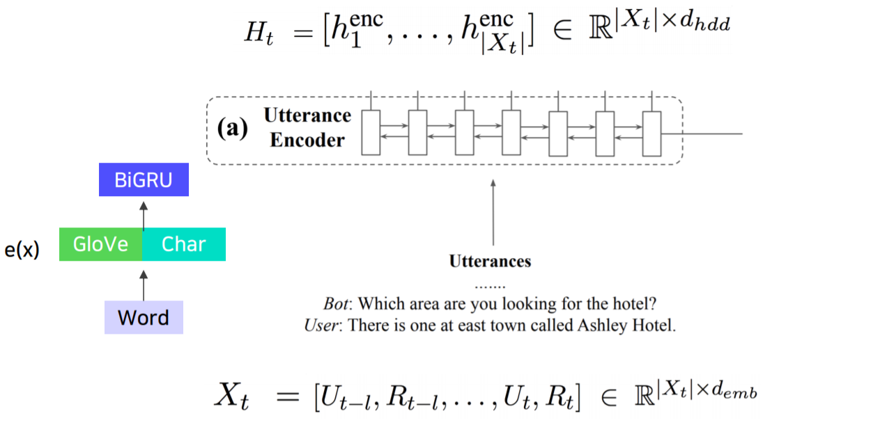
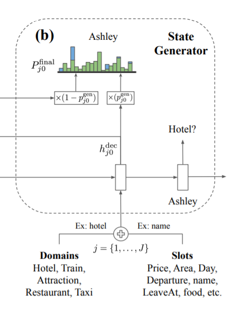
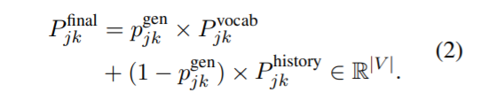
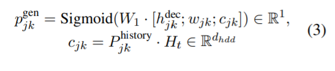
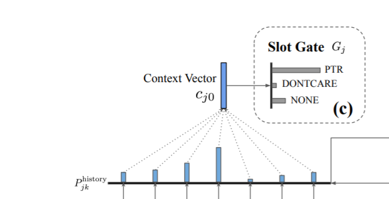
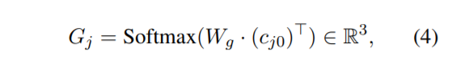
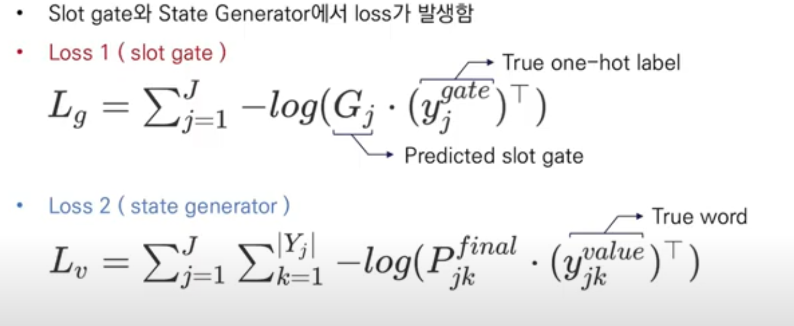
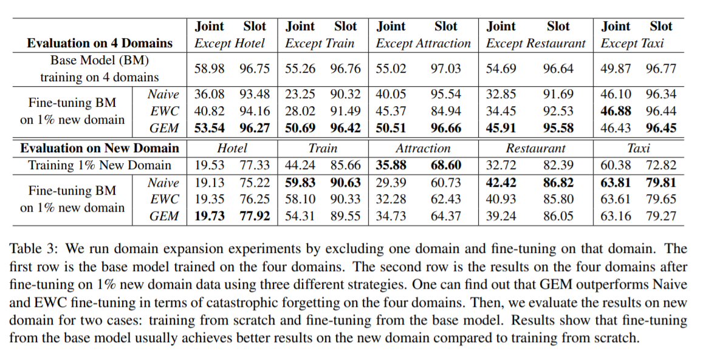

## TRADE

### 1. 전체 프로세스

1. 대화를 인코더를 통해 인코딩한다.
2. 인코딩된 대화와 슬롯으로 $$h$$를 만들고, 이를 바탕으로 $$p_{value}$$와 $$p_{hist}$$를 생성하여 $$p_{final}$$로 슬롯에 해당하는 value를 찾는다.
3. 대화와 슬롯으로 만들어진 $$h_{j0}$$를 사용하여 $$p_{hist}$$를 만들고, $$c_{j0}$$를 통해 slot의 value를 사용할지 결정한다.

---

### 2. Definition (Terminology)

- $$U_{T}$$: User Utterence
- $$R_{T}$$: System Response
- $$X_t = \{ (U_{t-l}, R_{t-l}), ... (U_{t}, R_{t})\}$$:  Utterance-Response pair
- $$D = \{ D_{1}, ..., D_{N} \}$$: Domain
- $$S = \{ S_{1}, ..., S_{M} \}$$: Slot
- $$Y^{value}_{j}$$: Value
- $$B = \{ B_{1}, ..., B_{T} \}$$: Tuple

### 3. Utterance Encoder

- 논문에서는 **Bi-directional GRU**사용 (어떤 종류의 Encoder로도 대체 가능)
- Input: $$X_t = \{ (U_{t-l}, R_{t-l}), ... (U_{t}, R_{t})\}$$
  - 슬라이딩 윈도우처럼 $$l$$값에 따라 $$t$$번째 턴에는 $$t-l$$부터 $$t$$까지의 대화쌍을 살펴봄
    - 베이스라인 코드에서는 $$t$$ 턴에는 처음부터 $$t$$ 턴까지 대화를 모두 봄
  - 더 구체적으로 말하자면, dialougue history 의 **모든 단어**를 **concatenation** 한 것
  - $$d_{emb}$$ 차원을 지님
- $$t$$ 턴까지의 대화쌍에서 토큰들의 관계를 알 수 있다.

### 4. State Generator

- Bi-directional GRU decoder 사용
- $$t$$ 턴까지의 대화 인코딩 $$h_t$$에 대해 max_length(value 중 가장 토큰을 많이 가진 길이)만큼 디코더로 디코딩 진행
- Copy mechanism을 통해 input dialougue의 정보를 활용하여 slot value를 generate
- 처음에는 도메인-슬롯의 임베딩 sum 을 입력으로 넣어주고 이를 통해 value 의 첫 토큰이 나온다.  
  다음으로는 이 토큰을 입력으로 넣어주고.. 계속하여 알맞는 value 를 뽑아낸다 (서울 + 롯데 + 호텔).  
  그러다 special token 이 나오면 value 생성을 그만한다.
- Pointer-Generator 방법 사용
  - 위에서 생성된 $$h^{dec}_{j0}$$로 $$p_{vocab}$$(대화와 슬롯을 봤을 때 vocab 에서는 어떤 단어와 유사한지), $$p_{hist}$$(대화와 슬롯을 봤을 때 이제까지의 대화 중에서는 어떤 단어와 유사한지)를 구한다.
  - **Vocab의 분포**와 **dialogue history의 분포**를 하나의 분포로 결합

- $$P^{vocab}_{jk}$$는 Utterence Encoder에서 나타나는 (domain, slot) $$j$$번째, $$k$$번째 value 생성 차례의 vocab 확률 분포를 나타냄
  - 여기서 $$E \in \R^{|V| \times d_{hdd}}$$를 나타내고, Trainable Embedding (vocab 개수 x dimension)
- $$P^{history}_{jk}$$는 Utterence Encoder에서 나타나는 (domain, slot) $$j$$번째, $$k$$번째 value 생성 차례의 history 확률 분포를 나타냄
  - 여기서 $$H_{t}$$는 Encode된 dialouge history를 나타냄

- $$P^{final}_{jk}$$는 $$P^{vocab}_{jk}$$, $$P^{history}_{jk}$$의 $$P^{gen}_{jk}, 1-P^{gen}_{jk}$$만큼의 확률분포를 곱해서 생성

- $$P^{gen}_{jk}$$는 다음 원소들로 구성됨
  - $$W_{1}$$: 가중치
  - $$h^{dec}_{jk}$$: (domain, slot) pair와 Utterance Encoding을 가지고 만들어진 hidden state vector
  - $$w_{jk}$$: word embedding
  - $$c_{jk}$$: context vector
  - ;는 concat을 나타냄

### 5. Slot Gate

- Slot Generator 에서 생성된 $$h^{dec}_{j0}$$(대화와 슬롯의 관계 정보)를 통해 $$p_{history}$$를 만들고, 이를 사용해 $$c_{j0}$$(Context vecto)를 만들 수 있다. Slot Gate는 Context vector로부터 slot의 존재 여부를 알아내는 역할을 수행
  - PTR, DONTCARE, NONE 3가지 label로 출력
  - PTR이 나오면 value를 Generate
  - DONTCARE, NONE이 나오면 Ignore

Slot gate $$G_{j}$$는 다음 원소로 구성됨

- $$W_{g}$$: 가중치
- $$c_{j0}$$: Context vector(first decoder Hidden state)

### 6. Optimization

> 출처 : [https://www.youtube.com/watch?v=nuclwoebdEM](https://www.youtube.com/watch?v=nuclwoebdEM)

- 최종 Loss는 다음으로 구성됨

$$L = \alpha L_{g} + \beta L_{v}$$

# 결과

### 1. Few/Zero-shot 실험 셋팅

- Target Domain을 학습 데이터에서 제외
    - 나머지 Source Domain의 데이터로 학습 후, Target Domain에 대한 성능 측정
- Few-Shot의 경우 Target Domain에 대한 아래 방법들로 1%의 Training data만 사용하여 학습
    - Elastic Weight Consolidation (EWC)
    - Gradient Episodic Memory (GEM)
    - Naive Fine-tuning (Naive)

### 2. 실험 결과

- **첫번째는 하나의 Domain만 제외(ex. Except Hotel)해서 훈련시킴**
    - 이후, 제외시킨 Domain (ex. Hotel)의 1% data를 fine-tuning했을 때의 결과
    - GEM을 사용했을 때 가장 좋은 성능이 나오는 것을 알 수 있음

- **두번째는 하나의 Domain만 훈련시킨 후 (ex. Hotel) 측정하는 방법**
    - Train, Taxi Domain에서 높은값들이 나오는 이유는 Domain끼리 겹치는 slot이 존재하기 때문

# 평가

- 새로운 domain(unseen domain)에 대해 robust한 모델
- Pointer-Generator를 사용해 Open-Vocabulary 방법을 사용
- turn마다 모든 슬롯 $$j$$에 대해 value를 생성하는 점이 비효율적임

---

## 참고 자료

- 논문: [Transferable Multi-Domain State Generator for Task-Oriented Dialogue Systems](https://arxiv.org/abs/1905.08743)
- 영상: [[Paper Review] Transferable Multi-Domain State Generator for Task-Oriented Dialogue Systems - KoreaUniv DSBA](https://www.youtube.com/watch?v=nuclwoebdEM)
- GitHub: [TRADE](https://github.com/jasonwu0731/trade-dst)
