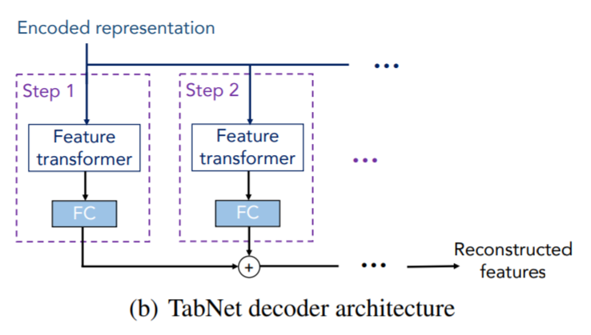
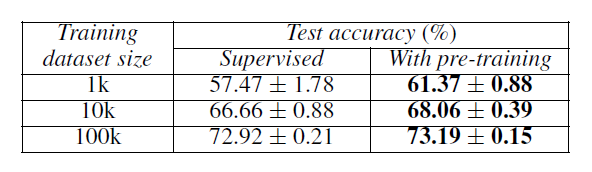

## TabNet

## 1. Abstract

- Sequential attention을 사용해서 각각의 decision step마다 여러 feature들 중에 중요한 feature들만 고름
- tabular data의 self-supervised learning도 가능함 (label이 안되어있는..)

## 2. Related work

### 1. Feature selection

- global methods: feature importance를 기반으로 하여 feature selection
- Instance-wise feature selection: response variable과 선택된 feature들간의 공통 정보를 최대화 하기 위해 explainer model을 사용해서 feature를 individually하게 뽑음
- TabNet: soft feature selection with controllable sparsity in end-to-end learning  
  → 단일 모델이 feature selection을 하고 output mapping까지 하는 구조

### 2. Tree-based learning

- tabular data를 위해 많이 사용
- variance를 줄이기 위해 앙상블 기법을 사용  
  → random forests, XGBoost, LightGBM 등이 있음
- 딥러닝이 feature selecting property를 retrainig 시키면 성능이 더 오를 수 있다고 주장

### 3. Integration of DNNs into DTs

### 4. Self-supervised learning

- small data에서 unsupervised representation learning이 성능을 향상시킴을 보임
- 최근 연구에서는 text와 image에서 큰 성능 향상의 폭을 보임
  - unsupervised learning과 딥러닝에서 현명한 masking을 통해서 학습을 시키면 좀 더 오름

## 3. Unsupervised pre-training vs Supervised fine-tuning

- Unsupervised Pre-training은 Mask를 씌우고 Mask를 씌운 부분을 맞추는 방법
    - Label이 따로 필요 없음
    - 엄청난 loss...
- Supervised fine-tuning은 다 채워진 tabular data를 가지고 Decision making을 하는 방법

## 4. Tabnet 특징

1. Data에서 Sparse instance-wise feature selection을 사용
  - salient features(두드러진 feature)들을 선택(selection)하는 것은 높은 성능을 내는데 중요한 요소(특히 dataset이 작을 때)
  - 따라서 dataset에서 subset을 만들어 determine(결정)하도록 재구성함

  

  - 위의 표와 같이 feature에 따른 subset을 만든 것이 Syn1 ~ Syn6 까지임
  - 여기서 Syn1 ~ Syn3까지의 값은 feature들끼리 독립적인 feature들을 사용
    - 이렇게 사용하면 global feature (성능이 가장 잘 나오는 이상적인 feature)에 가까워짐
  - 하지만 Syn4 ~ Syn6까지는 feature들끼리의 종속성이 존재함
    - instance끼리의 wise한 feature들
    - 이렇게 사용하면 global selection이 suboptimal로 선택되면서 성능이 낮아질 수 있음
  - 하지만 Tabnet은 instance-wise feature들을 sparse하게 사용하면서 global feature에 가까워지게 만들어줌

2. Sequential한 multi-step architecture을 가지고 있음

- 각 step들은 선택된 feature들을 가지고 decision을 내리는데 도움을 줌

3. feature 선택에 있어 non-linear한 processing을 사용하면서 learning capacity를 향상시킴

## 5. Tabnet 전체 Architecture

- 전체적으로는 Tabnet의 Encoder 부분과 Decoder 부분으로 구성됨
- Encoder 부분은 Sequential한 multi-setp processing ($$N_{steps}$$ decision steps로 구성됨)
- Decoder는 self-supervised learning을 할 때만 사용함

## 6. Feature selection

- Learnable Mask $$M[i] \in R^{B \times D}$$를 사용
    - salient feature들을 selection 하기 위해 사용함

- **Attentive transformer 사용**

  

  - 이전 단계에서 처리된 features들을 사용하여 mask를 얻는 방법
  - $$M[i] = sparsemax(P[i-1] \cdot h_{i}(a[i-1]))$$
    - $$a[i-1]$$: 이전 단계에서 처리된 feature
    - $$h_{i}$$: trainable function
      - FC layer와 BN을 의미함
    - $$P[i]$$: prior scale term
      - 특정한 feature가 이전에 얼마나 사용되었는지를 나타냄
      - $$P[i] = \prod^{i}_{j=1} ( \gamma - M[j] )$$
        - $$\gamma$$는 relaxation parameter
          - $$\gamma = 1$$일 때, feature가 한 decision step에서 한개만 사용하도록 함
          - $$\gamma$$가 증가하면 여러 decision step에서 feature들을 사용할 수 있음
        - $$P[0]$$이면 $$1^{B \times D}$$로 초기화 (모두 $$1$$로 초기화)
          - 1이면 feature를 사용한다는 의미이므로, feature를 사용하지 않을 때 $$P[0]$$을 $$0$$으로 만들어줌

## 7. Feature processing

- **Feature transformer 사용**

  

  - 대용량을 처리할 때도 robust한 learning을 만들기 위해서는, feature transformer는 `모든 decision step에서 공유되는 layer`와 `decision step-dependents layer`로 구성
    - `모든 decision step에서 공유되는 layer`를 쓰는 이유는 같은 feature들 모두 다른 decision step의 input으로 들어가기 때문
    - `decision-step-dependents layer`는 해당 decision일 때만 사용하는 feature들을 processing하는 부분
  - 위 사진에서는 다음과 같이 구성됨
    - 두 개의 shared layer
    - 두 개의 decision step-dependent layers
  - FC → BN → GLU로 연결
    - 밑에 있는 화살표는 normalized residual connection
    - Residual connection을 $$\sqrt{0.5}$$로 정규화하는 이유는 network 전체의 분산이 크게 변화지 않게 함으로써 학습 안정화에 도움이 됨 (Gehring et al. 2017)
  - 빠른 training을 위해 BN과 함께 large batch size를 사용해도 됨
    - ghost BN..?
  - Aggregation
    - 모든 decision을 embedding $$d[i]$$
    - $$d_{out} = \sum^{N_{steps}}_{i=1} RELU(d[i])$$
    - 이후, 마지막 linear를 태움: $$W_{final} d_{out}$$

- decision step의 output을 split함

## 8. Interpretability (해석 가능성)

- tabnet의 feature selection mask는 선택된 feature에서 강조표시를 할 수 있음
  - 일단, $$M_{b,j}[i] = 0$$이면, decision에 참여할 권한 없음
  - $$M_{b,j}[i]$$ 계수는 feature importance를 나타내는 $$f_{b,j}$$라고 볼 수 있음.
    ($$f_{i}$$가 linear function일 때)
    - 그렇지만 각각의 decision step이 non-linear하다고 하더라도, output을 linear하게 합치면 되기 때문에 상관없음
  - 서로 다른 단계에 있는 mask를 합치려면, decision의 각 단계에서 상대적 중요도를 평가할 수 있는 계수가 필요
    - 논문에서는 $$\eta b[i] = \sum^{N_{d}}_{c=1} RELU(d_{b,c}[i])$$
      - 즉, $$i^{th}$$번째 decision과 $$b^{th}$$의 sample들을 aggregate한 decision
    - 위 식을 사용해서 aggregate feature importance mask를 찾는 방법은 다음과 같음
      - $$M_{agg-b,j} = \frac {\sum^{N_{steps}}_{i=1} \eta b[i]M_{b,j}[i]} {\sum^{D}_{j=1} \sum^{N_{steps}}_{i=1} \eta b[i] M_{b,j}[i]}$$

## 9. self-supervised learning

- Self-supervised learning을 하기 위해 Decoder를 사용
- Decoder는 feature transformers, FC를 사용함
- mask를 씌운 부분을 맞추는 것이기 때문에 binary mask인 $$S \in \{0,1\}^{B \times D}$$를 사용
- Tabnet encoder에는 $$(1 - S) \cdot \hat{f}$$를 input으로 넣음  
  Tabnet decoder는 reconstructed featres인 $$S \cdot \hat{f}$$를 출력함  
- Reconstruction loss는 다음과 같이 계산됨

- We sample $$S_{b,j}$$ independently from a **Bernoulli distribution** with parameter $$p_{s}$$, at each iteration.

---

## 결과

- Regression과 Classification task를 수행할 수 있음
- Forest Cover Type Dataset에서 높은 accuracy를 보여줌

- Pocker Hand dataset에서도 좋은 성능을 보여줌

- Self-supervised learning에서 Dataset size가 크고, pre-training을 함께 진행했을 때 좋은 성능이 나오게됨

## Hyperparameter 설정 방법

$$N_d, N_a = \{8, 16, 24, 32, 64, 128\}$$  
$$N_{steps} = \{3, 4, 5, 6, 7, 8, 9, 10\}$$  
$$\gamma = \{1.0, .12, 1.5, 2.0\}$$  
$$\lambda_{sparse} = \{0, 0.000001, 0.0001, 0.001, 0.01, 0.1\}$$  
$$B = \{256, 512, 1024, 2048, 4096, 8192, 16384, 32768\}$$  
$$B_V = \{256, 512, 1024, 2048, 4096\}$$  
$$lr = \{0.005, 0.01, 0:02, 0.025\}$$  
$$decay \ rate = \{0.4, 0.8, 0.9, 0.95\}$$  

- **Guidelines for hyperparameters**
  - $$N_{steps}$$는 [3, 10] 사이가 optimal하다.
    - 너무 높은 $$N_{steps}$$를 사용하면 overfitting의 문제가 생길 수 있다
  - $$N_d, N_a$$의 설정 문제는 performance와 complexity의 trade-off 문제를 겪을 수 있다.
    - 따라서 $$N_a = N_d$$가 가장 이상적인 choice이다.
  - $$\gamma$$는 Tabnet의 hyperparameter에서 높은 성능을 낼 수 있는 중요한 역할
    - 대부분 larger $$N_{steps}$$를 사용하면 larger $$\gamma$$를 사용해야한다.
  - larger batch size를 사용하는 것이 이득이다.
  - large learning rate를 쓰는 것이 중요하다.
    - 어차피 decay될 것

---

# 평가

- tabular data를 처리할 수 있는 딥러닝
- unsupervised 방식도 가능함

---

## 참고 자료

- 논문: [TabNet: Attentive Interpretable Tabular Learning](https://arxiv.org/abs/1908.07442)
- GitHub: [TabNet](https://github.com/dreamquark-ai/tabnet)
