## Transformer-DST

## 1. Key Idea

- 이전 논문들에서는 Encoder에서 BERT를 사용하지만, Value Generation부분에서는 RNN Decoder를 사용하는 아이러니..
- Purely Transformer-based framework를 사용
즉, Single BERT가 **Encoder와 Decoder 모두**에서 work
→ 이렇게 하면 prediction objective와 value generation objective가 BERT 하나만 optimize하게 됨
- Encoder(BERT)에서 사용한 hidden states 값을 Decoder(BERT)에서 Re-use가 가능해짐

## 2. Input

- Input으로는 SOM-DST와 같은 구조를 지님
- 아래 그림과 같이 **D1, D2, S1을 INPUT**으로 넣고, **OUTPUT으로 S2**를 출력

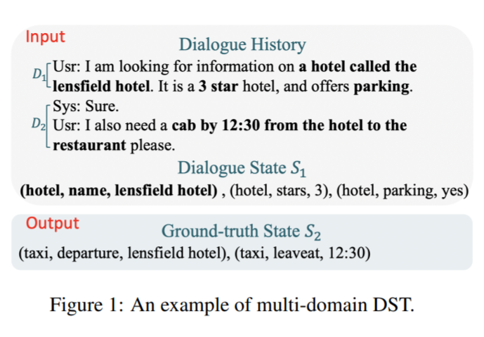

- $$D_{t-1}, D_{t}, S_{t-1}$$을 INPUT으로 $$S_{t}$$를 PREDICT
- $$D_{t}$$ : t번째 dialogue turn의 (System utterance, User response) pair
- $$S_{t}$$ : $$(d_{j}, s_{j}, v_{j}) | 1<=j<=J$$

여기서 $$d$$는 domain, $$s$$는 slot, $$v$$는 value를 나타냄

만약, 아무 정보도 없을시 $$(d_{j}, s_{j})$$로 나타내고, $$v_{j}$$는 NULL

## 3. Overview

- 왼쪽은 Transformer Encoder, 오른쪽은 Transformer Decoder
- Encoder (왼쪽)에서 $$h_{sl}^{L}$$ (hidden state)를 뽑아내고, Decoder (오른쪽)에서 Re-use하는 방법으로 사용됨
- Decoder (오른쪽)은 left-to-right attention (왼쪽에서 오른쪽으로 차례로 출력하는 language model, 즉 왼쪽 출력값이 오른쪽 입력)

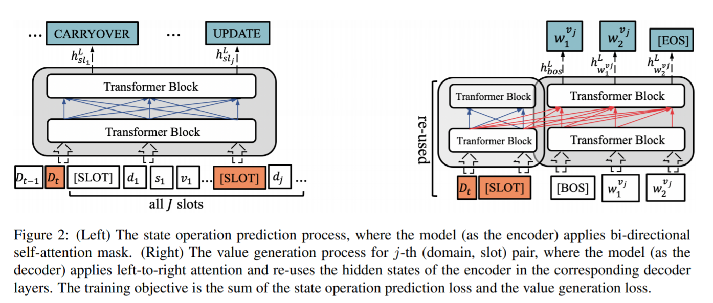

## 4. Encoder

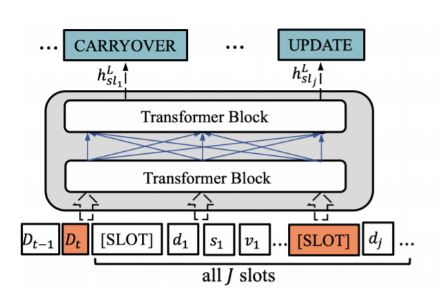

- Encoder의 Input은 $$D_{t-1}, D_{t}, S_{t-1}$$ 3가지가 들어감
    - $$D_{t}$$는 t번째 turn의 ( System Utterance, User Resposne ) pair
    - $$S_{t-1}$$은 $$(d_{j}, s_{j}, v_{j}) | 1<= j <= J$$

### 4-1) Encoder Input

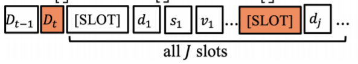

- $$[SLOT] \bigoplus d_{j} \bigoplus - \bigoplus s_{j} \bigoplus - \bigoplus v_{j}$$ 으로 구성
    - $$\bigoplus$$는 concat을 나타냄
    - 총 $$J$$개의 domain-slot에 대해서 만들어줌
    - $$[SLOT] \bigoplus d_{j} \bigoplus - \bigoplus s_{j} \bigoplus - \bigoplus v_{j}$$  * J번
- $$[SLOT]$$은 Transformer block을 통과한 후, $$X^{l}_{sl_{j}}$$ 형태로 출력되며, Prediction (CARRYOVER, ..., UPDATE 등)으로 사용됨

### 4-2) Multi-head self-attention

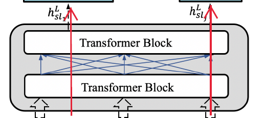

- Multi-head Self-attention 매카니즘 사용

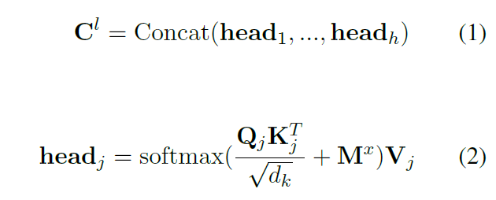

- 여기서 $$M^{x}$$ : self-attention mask matrix
    - $$M^{x} \in R^{|x| \times |x|}$$
    - $$M^{x}_{ij} \in \{0, - \infty \}$$
    - $$M^{x}_{ij} = 0$$이면 i-th position이 j-th position에 attend하다는 의미
    - $$M^{x}_{ij} = -\infty$$이면 i-th position과 j-th position을 prevents하겠다는 의미

### 4-3) Encoder Output

$$X^{L} = [x^{L}_{cls}, x^{L}_{1}, ..., x^L_{sl_{1}}, ..., x^{L}_{sl_{J}},...]$$

### 4-4) Encoder Objective

- Encoder outputs $$x^{L}_{sl_{j}}$$에서 $$[SLOT]$$칸에 해당하는 값을 확인
- CARRYOVER, DELETE, DONTCARE, UPDATE
- UPDATE의 경우에만 decoder generater에서 사용함

## 5. Decoder (Slot Value Generation)

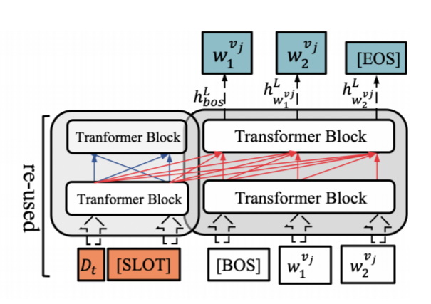

- Left-to-right self-attention을 사용함
- Encoder에서 도출해낸 hidden states를 decoder에서 reuse
- Resue의 의미는 hidden state를 decoder에서 다시 한번 계산할 필요가 없어진다는 의미를 갖음.

### 5-1) Decoder Input

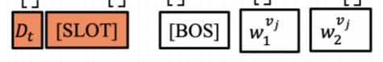

- Encoder (reuse)
    - 왼쪽의 $$D_{t}$$와 $$[SLOT]$$은 Encoder 부분을 나타냄
    - 현재 turn의 $$D_{t}$$의 hidden state vector를 사용함
    - $$[SLOT]$$ 중 UPDATE로 prediction이 된 hidden state vector만 사용함
- Decoder
    - $$[BOS]$$는 String의 시작
    - $$w^{v_{j}}_1, w^{v_{j}}_2$$는 decoder의 output을 다시 input으로 가지고 와서 사용 (left-to-right self-attention)

### 5-2) Left-to-right self-attention

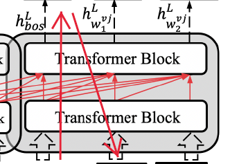

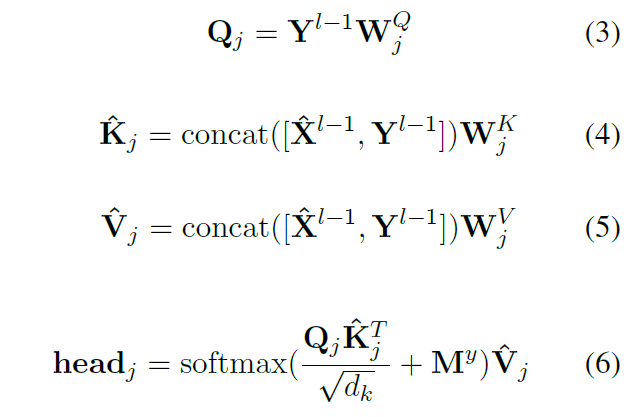

- 일반 Multi-head attention하고 비슷
- $$\hat{X}$$ : re-used된 encoder hidden states
- $$Y$$ : Decoder hidden states
- $$\hat{X}$$와 $$Y$$를 concat해서 사용
- 만약 $$j \leq i$$일때,  $$M^{y}_{ij} = 0$$ 으로 사용 (left-to-right attention)

### 5-3) Decoder Objective

- **Generated slot value loss**와 **ground-truth slot value**를 비교해서  Loss를 산출
- Teacher Forcing을 모든 time에서 사용

# 결과

- MutliWOZ 2.0과 MultiWOZ 2.1에서 제출 당시 SOTA

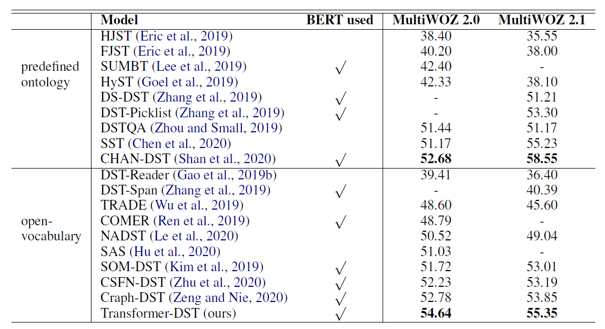

- 각각의 Domain의 Joint goal Accuracy를 비교
    - 신기한 점은 Taxi 빼고 (다른 모델보다) 높은 성능을 보임
    - 이유를 찾아보니 Taxi의 경우 Train과의 co-occurrence relations가 있음
    - 하지만 Ours에는 이러한 점을 해결하려고 하지는 않았음

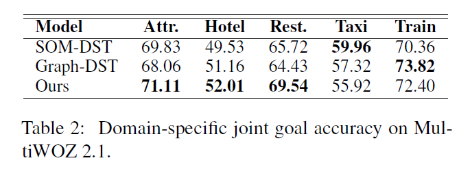

- 시간의 경우 SOM-DST보다는 Inference time이 오래걸림

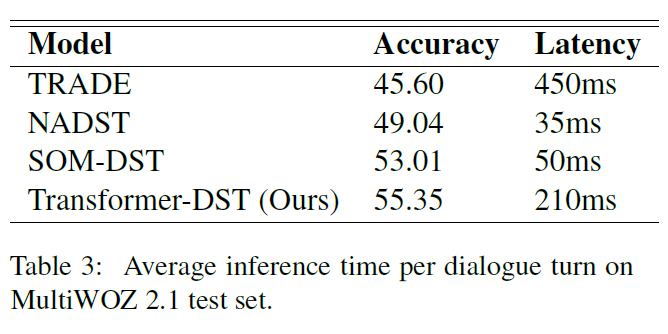

- Reuse를 사용했을 경우에도 여러가지 방법을 시도해보았고, $$D_{t} + [SLOT]$$을 사용했을 때 Joint Accuracy에서 좋은 성능을 보였음

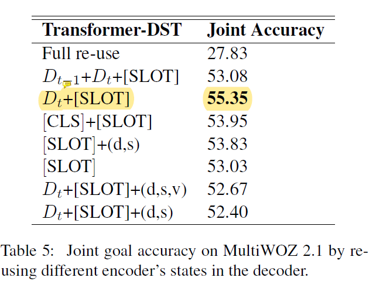

---

## 참고 자료

- 논문: [Jointly Optimizing State Operation Prediction and Value Generation for Dialogue State Tracking](https://arxiv.org/abs/2010.14061)
- GitHub: [Transformer-DST](https://github.com/zengyan-97/Transformer-DST)
